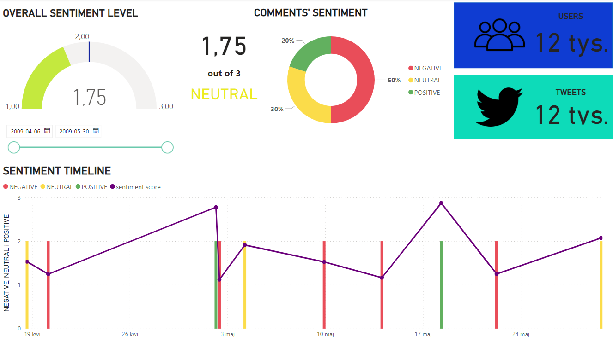

# Sentiment analysis pipeline
[](https://forthebadge.com)
[](https://forthebadge.com)

The project consists in cyclical downloading of data from Twitter, and then conducting sentiment analysis of these tweets.


## Getting Started


### Prerequisites
This software uses the following open source packages:
- Python 3.10
- Airflow
- Dask
- Fastapi
- Uvicorn
- Pandas

## Usage


```
1. Brand Monitoring
2. Customer Service
3. Public Opinion Analysis
4. Stock Market Analysis
5. Crisis Management
6. Social Listening
```


## Authors
  - [Dominik Żurek](https://github.com/dominik-air)
  - [Jakub Elias](https://github.com/keliasz)
  - [Arkadiusz Kontek](https://github.com/niziox)
  - [Agnieszka Kojs](https://github.com/agnieszkakojs)

[(Back to top)](#table-of-contents)


